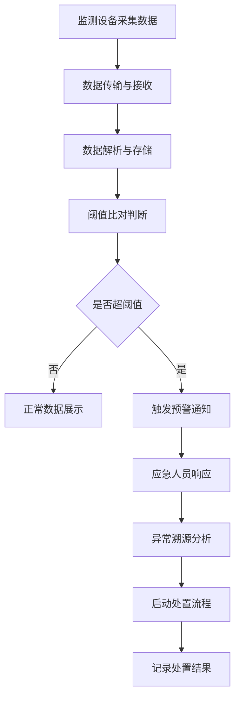
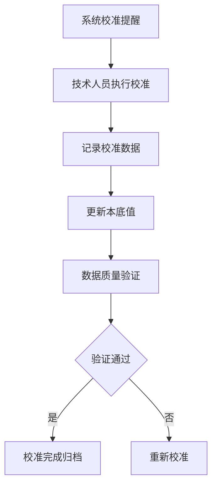

## 1. 产品概述

核辐射环境监测Web系统是为环保部门打造的专业级辐射监测管理平台，实现对辖区内核辐射环境的全方位实时监控与智能化管理。

- 主要目标：统一管理核辐射监测点位、实时采集辐射数据、智能预警异常情况、规范应急处置流程、保障环境辐射安全
- 目标用户：环保部门管理人员、辐射监测技术人员、应急响应人员、数据分析人员
- 产品价值：提升核辐射环境监测效率，实现数据驱动的科学决策，快速响应核辐射突发事件，保障公众环境安全

## 2. 核心功能

### 2.1 用户角色

| 角色 | 注册方式 | 核心权限 |
|------|----------|----------|
| 系统管理员 | 后台创建 | 全系统管理、用户权限配置、系统参数设置 |
| 监测人员 | 管理员创建 | 监测点管理、设备校准、数据采集查看 |
| 应急人员 | 管理员创建 | 预警查看、应急处置、异常溯源 |
| 数据分析员 | 管理员创建 | 趋势分析、报告生成、数据查询 |

### 2.2 功能模块

1. **监测点位**：监测点分布地图、点位信息管理、设备状态监控
2. **实时数据**：辐射剂量率实时采集、实时数据展示、异常数据标记
3. **剂量趋势**：累积剂量趋势分析、多维度数据对比、图表可视化
4. **异常预警**：超阈值自动预警、预警级别管理、预警通知推送
5. **应急处置**：应急响应流程、异常溯源分析、处置记录管理
6. **设备校准**：校准周期管理、本底值管理、数据质控管理
7. **报告生成**：监测报告生成、人员剂量档案、历史数据查询

### 2.3 页面详情

| 页面名称 | 模块名称 | 功能描述 |
|----------|----------|----------|
| 监测点位 | 监测点分布地图 | 基于地图展示所有监测点位置，支持缩放、筛选、点击查看详情 |
| 监测点位 | 点位信息列表 | 表格展示所有监测点的基本信息、设备型号、状态、安装时间等 |
| 监测点位 | 设备状态监控 | 实时显示各监测点设备的在线/离线状态、运行参数、电量/网络信号 |
| 实时数据 | 实时数据大屏 | 展示当前各监测点辐射剂量率数值、单位（nSv/h、μGy/h）、采集时间 |
| 实时数据 | 数据列表展示 | 按监测点分组展示实时采集数据，支持排序、筛选、刷新 |
| 实时数据 | 异常数据标记 | 高亮显示超过阈值的异常数据条目，标注预警级别 |
| 剂量趋势 | 累积剂量趋势图 | 折线图/面积图展示日/周/月/年累积剂量变化趋势 |
| 剂量趋势 | 多维度对比 | 支持不同监测点、不同时间段数据的横向与纵向对比 |
| 剂量趋势 | 图表可视化 | 提供柱状图、饼图、热力图等多种图表类型展示数据分布 |
| 异常预警 | 预警列表 | 展示所有预警记录，包含时间、点位、数值、级别、状态 |
| 异常预警 | 预警级别管理 | 按阈值配置预警级别（提示、警告、严重、紧急）及颜色标识 |
| 异常预警 | 预警通知推送 | 支持站内消息、弹窗提醒、声音告警等多种通知方式 |
| 应急处置 | 应急响应流程 | 标准化应急处置流程图，分步骤指导响应行动 |
| 应急处置 | 异常溯源分析 | 基于数据趋势和点位分布进行异常来源追踪分析 |
| 应急处置 | 处置记录管理 | 记录每次应急事件的处置过程、人员、措施、结果 |
| 设备校准 | 校准周期管理 | 记录设备校准时间、下次校准时间、校准状态提醒 |
| 设备校准 | 本底值管理 | 管理各监测点的辐射本底值，支持本底值校准与更新 |
| 设备校准 | 数据质控 | 数据质量检查、缺失数据补全、异常值识别与处理 |
| 报告生成 | 监测报告 | 自动生成日报/周报/月报/年报，支持Word/PDF导出 |
| 报告生成 | 人员剂量档案 | 管理工作人员的个人剂量记录、统计、超剂量提醒 |
| 报告生成 | 历史数据查询 | 按时间范围、监测点、数据类型等条件查询历史数据 |

## 3. 核心流程

### 3.1 数据采集与预警流程
系统通过监测设备实时采集辐射数据，数据经传输后进入系统处理模块，自动与阈值比对，如超出阈值则触发预警，通知相关人员启动应急响应。

### 3.2 设备校准流程
设备到达校准周期时系统自动提醒，技术人员进行校准操作，更新校准记录与本底值，确保数据准确性。

## 4. 用户界面设计

### 4.1 设计风格
- **主色调**：深科技蓝 (#0D1B2A) 作为主背景，放射性警示黄 (#FFD60A) 作为预警强调色，安全绿 (#2EC4B6) 作为正常状态色
- **辅助色**：危险红 (#E63946)、信息蓝 (#457B9D)、橙色预警 (#FF9F1C)
- **字体**：使用现代科技感字体 "JetBrains Mono" 展示数据，"Noto Sans SC" 展示中文内容
- **按钮风格**：扁平设计配合微边框，hover 时有发光效果，圆角 4px
- **布局风格**：左侧导航栏 + 顶部状态栏 + 主内容区，采用深色仪表盘（Dashboard）风格
- **图标风格**：使用线性风格图标，配合辉光效果营造科技感

### 4.2 页面设计概览

| 页面名称 | 模块名称 | UI元素 |
|----------|----------|--------|
| 监测点位 | 分布地图 | 全屏暗色地图底图、发光监测点标记、分级颜色编码、悬停弹窗信息卡片、缩放控件 |
| 监测点位 | 信息列表 | 斑马纹表格、状态徽章、分页控件、搜索筛选栏 |
| 实时数据 | 数据大屏 | 大字号数字显示、实时更新动画、状态颜色背景、网格布局、脉冲指示灯 |
| 剂量趋势 | 趋势图表 | 渐变面积图、双Y轴、时间选择器、图例开关、数据点悬停提示 |
| 异常预警 | 预警列表 | 按级别颜色高亮的卡片列表、闪烁动画、处置状态标签、时间线展示 |
| 应急处置 | 响应流程 | 步骤时间轴、当前步骤高亮、操作按钮、进度百分比 |
| 设备校准 | 校准面板 | 进度环展示校准状态、倒计时提醒、表单输入区、操作日志 |
| 报告生成 | 报告预览 | A4尺寸模拟页面、章节导航、导出按钮、打印样式 |

### 4.3 响应式设计
- 采用桌面优先设计，最小支持 1366×768 分辨率
- 侧边栏在小屏幕可折叠为图标模式
- 数据表格在移动端自动转为卡片布局
- 图表组件自适应容器宽度

### 4.4 动效设计
- 页面加载时元素渐入动画，延迟错开呈现
- 数据更新时数字滚动效果
- 预警发生时红色闪烁 + 轻微震动动画
- 导航切换时内容区滑动过渡
- 悬停状态发光与放大效果
