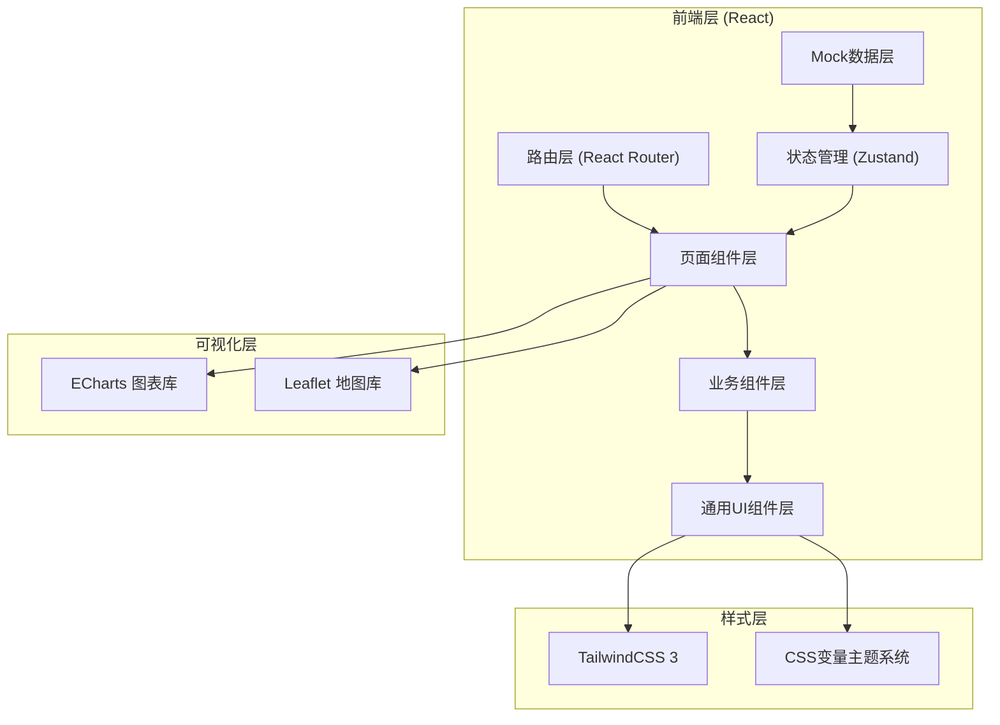

## 1. 架构设计



## 2. 技术说明

- **前端框架**: React 18 + TypeScript
- **构建工具**: Vite 5
- **样式方案**: TailwindCSS 3 + PostCSS
- **路由管理**: React Router v6
- **状态管理**: Zustand (轻量级状态管理)
- **图表可视化**: ECharts 5
- **地图组件**: Leaflet (开源地图，无需API Key)
- **图标库**: Lucide React (线性风格图标)
- **日期处理**: dayjs
- **后端**: 无，使用 Mock 数据模拟
- **数据持久化**: localStorage 存储配置与缓存

## 3. 路由定义

| 路由路径 | 页面组件 | 页面功能 |
|----------|----------|----------|
| / | Dashboard | 系统概览仪表盘（默认首页） |
| /monitoring-points | MonitoringPoints | 监测点位管理（地图+列表） |
| /realtime-data | RealtimeData | 实时数据展示大屏 |
| /dose-trend | DoseTrend | 累积剂量趋势分析 |
| /alerts | Alerts | 异常预警管理 |
| /emergency | Emergency | 应急处置流程 |
| /calibration | Calibration | 设备校准管理 |
| /reports | Reports | 报告生成与数据查询 |

## 4. 数据模型（TypeScript类型定义）

### 4.1 监测点数据模型

```typescript
interface MonitoringPoint {
  id: string;
  name: string;
  code: string;
  location: {
    lat: number;
    lng: number;
    address: string;
    district: string;
  };
  device: {
    model: string;
    serialNumber: string;
    installDate: string;
    manufacturer: string;
  };
  status: 'online' | 'offline' | 'maintenance' | 'fault';
  batteryLevel: number;
  signalStrength: number;
  backgroundValue: number;
  lastCalibrationDate: string;
  nextCalibrationDate: string;
  createdAt: string;
}
```

### 4.2 实时监测数据模型

```typescript
interface RadiationReading {
  id: string;
  pointId: string;
  pointName: string;
  doseRate: number;
  unit: 'nSv/h' | 'μGy/h';
  accumulatedDose: number;
  temperature: number;
  humidity: number;
  timestamp: string;
  isAbnormal: boolean;
  alertLevel: 'normal' | 'notice' | 'warning' | 'severe' | 'emergency';
}
```

### 4.3 预警记录模型

```typescript
interface Alert {
  id: string;
  pointId: string;
  pointName: string;
  level: 'notice' | 'warning' | 'severe' | 'emergency';
  value: number;
  threshold: number;
  unit: string;
  description: string;
  timestamp: string;
  status: 'pending' | 'processing' | 'resolved' | 'ignored';
  handler?: string;
  resolvedAt?: string;
  resolution?: string;
}
```

### 4.4 设备校准记录模型

```typescript
interface CalibrationRecord {
  id: string;
  pointId: string;
  pointName: string;
  calibrationDate: string;
  operator: string;
  beforeValue: number;
  afterValue: number;
  backgroundValue: number;
  certificateNumber: string;
  result: 'pass' | 'fail' | 'conditional';
  remarks: string;
  nextCalibrationDate: string;
}
```

### 4.5 应急处置记录模型

```typescript
interface EmergencyRecord {
  id: string;
  alertId: string;
  title: string;
  level: 'notice' | 'warning' | 'severe' | 'emergency';
  startTime: string;
  endTime?: string;
  status: 'active' | 'contained' | 'resolved';
  handler: string;
  team: string[];
  steps: EmergencyStep[];
  traceability: string;
  summary: string;
}

interface EmergencyStep {
  id: string;
  stepNumber: number;
  name: string;
  description: string;
  status: 'pending' | 'in_progress' | 'completed';
  operator?: string;
  completedAt?: string;
}
```

### 4.6 人员剂量档案模型

```typescript
interface PersonnelDose {
  id: string;
  name: string;
  employeeId: string;
  department: string;
  position: string;
  monthlyDose: number;
  quarterlyDose: number;
  yearlyDose: number;
  totalDose: number;
  limit: number;
  unit: 'mSv';
  lastUpdated: string;
}
```

### 4.7 监测报告模型

```typescript
interface MonitorReport {
  id: string;
  type: 'daily' | 'weekly' | 'monthly' | 'yearly' | 'custom';
  title: string;
  startDate: string;
  endDate: string;
  generateTime: string;
  generatedBy: string;
  summary: {
    totalReadings: number;
    abnormalCount: number;
    avgDoseRate: number;
    maxDoseRate: number;
    pointsOnline: number;
    pointsTotal: number;
  };
  status: 'draft' | 'final';
}
```

## 5. 目录结构设计

```
src/
├── assets/              # 静态资源（字体、图片等）
├── components/          # 通用UI组件
│   ├── ui/             # 基础UI组件（Card、Badge、Button等）
│   ├── layout/         # 布局组件（Sidebar、Header等）
│   └── charts/         # 图表组件封装
├── pages/              # 页面组件
│   ├── Dashboard.tsx
│   ├── MonitoringPoints.tsx
│   ├── RealtimeData.tsx
│   ├── DoseTrend.tsx
│   ├── Alerts.tsx
│   ├── Emergency.tsx
│   ├── Calibration.tsx
│   └── Reports.tsx
├── store/              # Zustand 状态管理
│   ├── useMonitorStore.ts
│   └── useAlertStore.ts
├── data/               # Mock 数据
│   ├── mockPoints.ts
│   ├── mockReadings.ts
│   ├── mockAlerts.ts
│   └── mockReports.ts
├── types/              # TypeScript 类型定义
│   └── index.ts
├── utils/              # 工具函数
│   ├── format.ts
│   └── constants.ts
├── App.tsx
├── main.tsx
└── index.css
```

## 6. 主题系统设计

使用 CSS 变量定义深色科技风主题：

```css
:root {
  --color-bg-primary: #0D1B2A;
  --color-bg-secondary: #1B2838;
  --color-bg-tertiary: #243447;
  --color-border: #2D3F54;
  --color-text-primary: #E8EEF2;
  --color-text-secondary: #8AA4B8;
  --color-text-muted: #5C7A91;
  --color-accent-primary: #457B9D;
  --color-accent-success: #2EC4B6;
  --color-accent-warning: #FFD60A;
  --color-accent-danger: #E63946;
  --color-accent-notice: #FF9F1C;
  --glow-primary: rgba(69, 123, 157, 0.4);
  --glow-success: rgba(46, 196, 182, 0.4);
  --glow-warning: rgba(255, 214, 10, 0.4);
  --glow-danger: rgba(230, 57, 70, 0.4);
}
```
